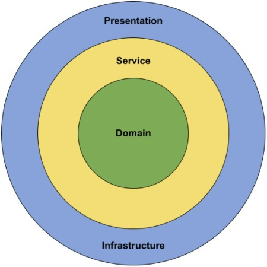

# dotnet-template 
###### under development

<p align="center">
  
</p>

A .NET/.NET Core template to use Onion Architecture and DDD (Domain Driven Design) with CQRS and ES with a simple example on how to use all this architecture together from the Controller until the Repository class using Domain objects and different patterns.

### Documentation

You can find information about this template in:

- [Main Architecture](docs/ARCHITECTURE.md)
- [Hexagonal Architecture](docs/HEXAGONAL.md)
- [DDD](docs/DDD.md)
- [CQRS AND ES](docs/CQRS-ES.md)
- [SOLID](docs/SOLID.md)

### Prerequisites

#### .NET 6

Ensure you have the correct dotnet-core SDK installed for your system:

https://dotnet.microsoft.com/download/dotnet/6.0

This is just the version used by the template, if you need to use a newer or older one, you can do it manually after.

### Usage

1. Clone this repository
2. To allow the api to be created you will need to install the template from nuget:

```
dotnet new -i {{Path_where_you_cloned_the_repository}}
```

- Example:

```
dotnet new -i C:\GitLocal\dotnet-template-onion
```

3. To check that the template has been installed successfully:

```
dotnet new -l
```

- There should now be a new template **dotnet_template_onion**

```
Templates                                          Short Name                 Language          Tags
----------------------------------------------------------------------------------------------------------
.NET Core 6.0 Template with CQRS, ES and DDD       dotnet_template      [C#]              Web/API/Microservices
```

4. Create the .Net Core Solution

```
dotnet new dotnet_template_onion -n {{Namespace_of_your_project}} -o <outputFolder>
```

- This will create the folder containing a solution and project folder.
  

And you are ready to go, you can use Visual Studio, Visual Studio Code or any other IDE to proceed with your coding.

### Structure of the template

```
C:.
│   .gitignore
│   Template.sln
│   README.md
│
├───docs
│       ARCHITECTURE.md
│       CQRS-ES.md
│       DDD.md
│       HEXAGONAL.md
│       SOLID.md
│
├───images
│       logo.jpeg
│
├───src
│   ├───Template.Presentation
│   │   │   .dockerignore
│   │   │   Dockerfile
│   │   │   Template.Presentation.csproj
│   │   │   Program.cs
│   │   │   Startup.cs
│   │   │
│   │   ├───Bindings
│   │   ├───Config
│   │   │       appsettings.json
│   │   │
│   │   ├───Controllers
│   │   │       TemplateController.cs
│   │   │
│   │   ├───Extensions
│   │   │   └───Middleware
│   │   │           ErrorDetails.cs
│   │   │           ExceptionMiddleware.cs
│   │   │
│   │   └───Properties
│   │           launchSettings.json
│   │
│   ├───Template.Application
│   │   │   Template.Application.csproj
│   │   │
│   │   ├───Handlers
│   │   │       TemplateCommandHandler.cs
│   │   │       TemplateEventHandler.cs
│   │   │
│   │   ├───Mappers
│   │   │       TemplateViewModelMapper.cs
│   │   │
│   │   ├───Services
│   │   │       ITemplateService.cs
│   │   │       TemplateService.cs
│   │   │
│   │   └───ViewModels
│   │           TemplateViewModel.cs
│   │
│   ├───Template.Domain
│   │   │   Template.Domain.csproj
│   │   │   IAggregateRoot.cs
│   │   │   IRepository.cs
│   │   │
│   │   └───Templates
│   │       │   ITemplateFactory.cs
│   │       │   ITemplateRepository.cs
│   │       │   Template.cs
│   │       │
│   │       ├───Commands
│   │       │       CreateNewTemplateCommand.cs
│   │       │       DeleteTemplateCommand.cs
│   │       │       TemplateCommand.cs
│   │       │
│   │       ├───Events
│   │       │       TemplateCreatedEvent.cs
│   │       │       TemplateDeletedEvent.cs
│   │       │       TemplateEvent.cs
│   │       │
│   │       └───ValueObjects
│   │               Description.cs
│   │               Summary.cs
│   │               TemplateId.cs
│   │
│   └───Template.Infrastructure
│       │   Template.Infrastructure.csproj
│       │
│       ├───Factories
│       │       EntityFactory.cs
│       │       TemplateFactory.cs
│       │
│       └───Repositories
│               TemplateRepository.cs
│
└───tests
    └───Template.Tests
        │   Template.Tests.csproj
        │
        └───UnitTests
            ├───Application
            │   └───Services
            │           TemplateServiceTests.cs
            │
            └───Helpers
                    HttpContextHelper.cs
                    TemplateHelper.cs
                    TemplateViewModelHelper.cs
```