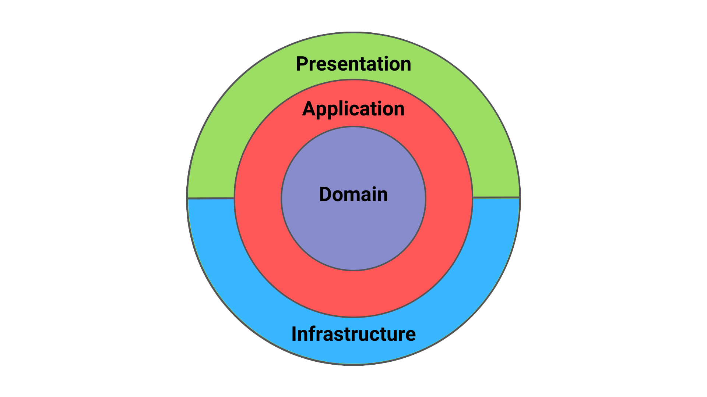

# .NET Template 
###### In development...

<p align="center">
  
</p>

A .NET/.NET Core template to use Clean Architecture and DDD (Domain Driven Design).

### Documentation

You can find information about this template in:

- [Main Architecture](docs/ARCHITECTURE.md)  -> Under construction.
- [Hexagonal Architecture](docs/HEXAGONAL.md)  -> Under construction.
- [DDD](docs/DDD.md)  -> Under construction.
- [CQRS AND ES](docs/CQRS-ES.md) -> Under construction.
- [SOLID](docs/SOLID.md) 

### Prerequisites

#### [.NET 6](https://dotnet.microsoft.com/download/dotnet/6.0)
#### [Docker]()

This is just the version used by the template, if you need to use a newer or older one, you can do it manually after.

### Usage

1. Clone this repository
2. To allow the api to be created you will need to install the template from nuget:

```
dotnet new -i {{Path_where_you_cloned_the_repository}}
```

- Example:

```
dotnet new -i "C:\your-paste\dotnet-template\template"
```

3. To check that the template has been installed successfully:

```
dotnet new -l
```

- There should now be a new template **dotnet_template_onion**

```
Templates                                          Short Name                 Language          Tags
----------------------------------------------------------------------------------------------------------
.NET Core 6.0 Template with CQRS and DDD       webapi-tiers      [C#]              Web/API/Microservices
```

4. Create the .Net Core Solution

```
dotnet new dotnet_template -n {{Namespace_of_your_project}} -o <outputFolder>
```

- This will create the folder containing a solution and project folder.
  

And you are ready to go, you can use Visual Studio, Visual Studio Code or any other IDE to proceed with your coding.

### Structure of the template

```
C:.
│
├───Core
│   │
│   ├───Template.Application
│   │   │   
│   │   └Template.Application.csproj
│   │   
│   │
│   └───Template.Domain
│       │   
│       └Template.Domain.csproj
│   
│  
│        
├───External
│   │
│   ├───Template.Presentation
│   │ 
│   └───Template.Infrastructure
│       │   DependencyInjection.cs
│       │   Template.Infrastructure.csproj
│       │
│       ├───DataContext
│       │       ApplicationDbContext.cs
│       │
│       ├───Migrations 
│       │
│       ├───Common
│       │       BaseRepository.cs
│       │
│       └───Repositories
│               TemplateRepository.cs
│
└───Tests
    └───Architecture.Tests
        │   └───Architecture.Tests.csproj
        │
        └───Unit.Tests
              └───Unit.Tests.csproj
```